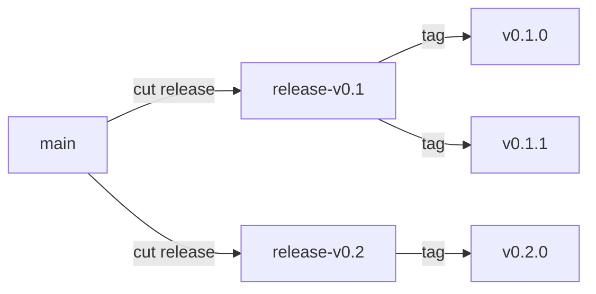
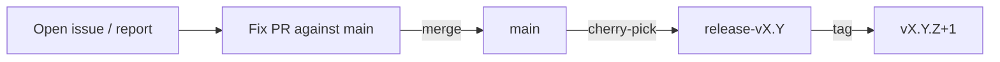
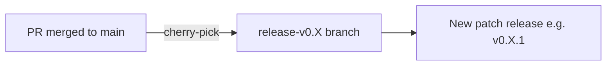

# Release Process

This document describes how IronCore projects branch for releases, ship hotfixes, and cherry-pick changes
from `main` into a release branch for patch releases.

## Branching Model

IronCore projects follow a simple, trunk-based branching model:

- `main` is the active development branch. All new work — features, refactors, and bug fixes — lands on `main`
  first via pull request.
- `release-vX.Y` branches track a minor release line (e.g. `release-v0.1`, `release-v0.2`). They are created when
  a new minor version is cut and are the source of all patch releases for that line.
- `vX.Y.Z` tags are created on a release branch to mark each release.



### Cutting a New Minor Release

In most major IronCore projects the release branch is created automatically by a GitHub Actions workflow:
whenever a new minor version is released on `main` (e.g. `v0.2.0`), the workflow creates the matching
`release-v0.2` branch off of that tag. In other words, the release branch is a side-effect of cutting the
minor release — not a manual step.

If a project does not (yet) have this automation, the release branch can be created by hand:

1. **Create the release branch** from the commit that was tagged for the minor release:

    ```shell
    git fetch origin
    git checkout -b release-v0.2 v0.2.0
    git push origin release-v0.2
    ```

2. **Continue development on `main`.** From this point on, fixes that need to ship in the `v0.2.x` line are
   cherry-picked from `main` into `release-v0.2` (see below), and each patch release is cut by tagging the
   release branch (e.g. `v0.2.1`).

## Hotfix Workflow

A *hotfix* is a targeted bug fix that needs to ship in an existing release line without waiting for the next
minor release. The rule is:

> **Fix on `main` first, then cherry-pick into the release branch.**

This keeps `main` as the single source of truth and ensures the fix is not lost in the next minor release.

The full flow:



1. **Open a fix PR against `main`.** Even if the bug only manifests on a release branch, fix it on `main` first
   so the next minor release inherits the fix automatically.
2. **Merge the PR** following the usual [code review process](/contributing#code-review).
3. **Cherry-pick the merge commit** into the affected release branch (see [Cherry-Picking PRs into Release
   Branches](#cherry-picking-prs-into-release-branches)). If the fix applies to multiple release lines, repeat
   for each branch.
4. **Cut a new patch release** on the release branch by tagging it (e.g. `v0.2.1`).

If the fix cannot land on `main` first — for example, because `main` has diverged and the fix only applies to
the older release line — open the PR directly against the release branch and call this out in the PR
description. This should be the exception, not the rule.

## Cherry-Picking PRs into Release Branches

When a bug fix or change needs to be included in an existing release (e.g. `v0.1.1`), the corresponding PR
that was merged into `main` can be cherry-picked into the appropriate release branch (e.g. `release-v0.1`).



### Prerequisites

- [gh CLI](https://cli.github.com/) installed and authenticated
- Clean git working tree

### Using the cherry-pick script

A convenience script is provided at `hack/cherry-pick.sh`. It automates the entire process: creating a branch,
cherry-picking the merge commit, pushing, and opening a PR against the release branch.

```shell
./hack/cherry-pick.sh <PR-number> <release-branch>
```

#### Example

Cherry-pick PR #123 into the `release-v0.1` branch:

```shell
./hack/cherry-pick.sh 123 release-v0.1
```

This will:

1. Fetch the merge commit of PR #123 from GitHub
2. Create a new branch `cherry-pick-123-into-release-v0.1` from `origin/release-v0.1`
3. Cherry-pick the merge commit
4. Push the branch and open a PR targeting `release-v0.1`

### Handling conflicts

If the cherry-pick results in merge conflicts, the script will stop and print instructions. To resolve:

1. Fix the conflicting files
2. Stage the resolved files with `git add`
3. Continue the cherry-pick:

    ```shell
    git cherry-pick --continue
    ```

4. Push and create the PR manually:

    ```shell
    git push origin cherry-pick-<PR>-into-<release-branch>
    gh pr create --base <release-branch> --title "🍒 [<release-branch>] <title>" --body "Cherry-pick of #<PR> into <release-branch>."
    ```

## Release notes

The [release-drafter](https://github.com/release-drafter/release-drafter) workflow automatically drafts release
notes for release branches. Once the cherry-pick PR is merged into the release branch, it will be included in
the next draft release for that branch.
